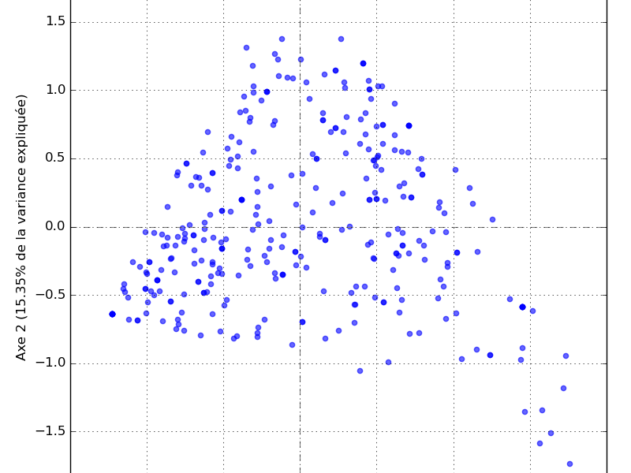

# QuestionnaireCircu

<!DOCTYPE html>
<html lang="fr">
<head>
  <meta charset="UTF-8">
  <title>Auto-évaluation : Circularité de votre entreprise</title>
  <link rel="stylesheet" href="style.css">
  
  
</head>
<body>
  <main>
    <h1>Estimation du profil circulaire</h1>
    

        Introduction du projet...
        Blablabla...
        
      Ce questionnaire vous permet de palcer votre entreprise parmi [combien ?] PME de la Région Hauts-de-France. Répondez simplement aux 10 questions qui suivent et cliquez sur le bouton "Soumettre".
    

    <form id="circularForm">
      

      <button type="submit">Soumettre</button>
    </form>

    

    
      

          Voici comment votre PME se situe par rapport aux PME de notre enquête :
      
 
      
    

      <h2>Distribution des PME (remplacer le placeholder)</h2>
      

        
        

      

    

    

      
Pour en savoir plus :

      <ul>
        <li><a href="rapport.pdf" target="_blank">Rapport scientifique du projet ICPME-HF</a></li>
        <li><a href="methodo.pdf" target="_blank">Méthodologie</a></li>
        <li><a href="mailto:joseph-eleazar.duhot@univ-lille.fr">Contact</a></li>
      </ul>
    

  </main>
</body>
</html>
